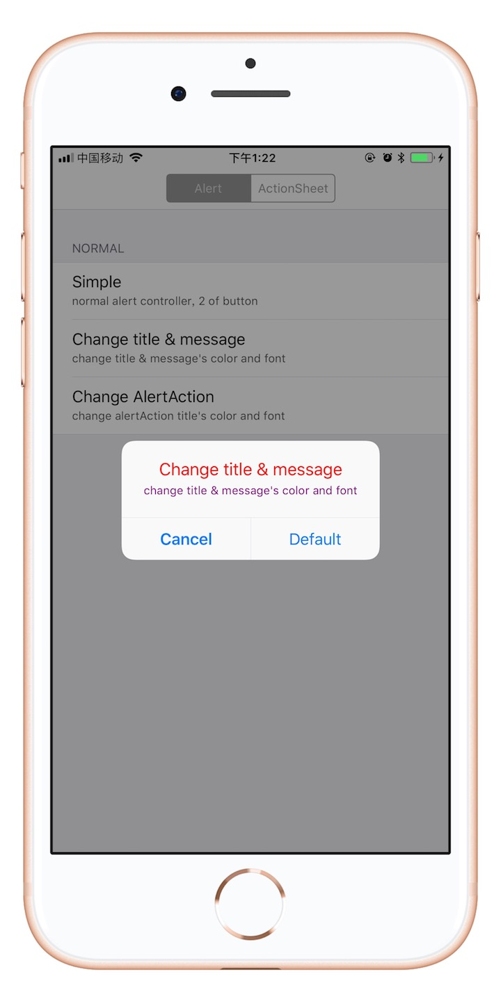
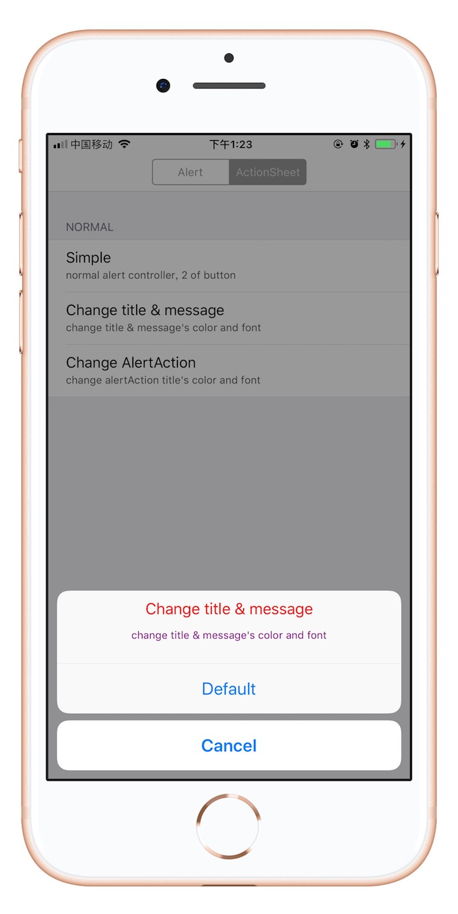
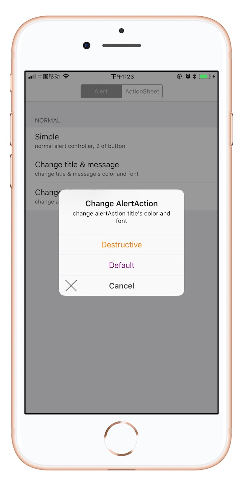
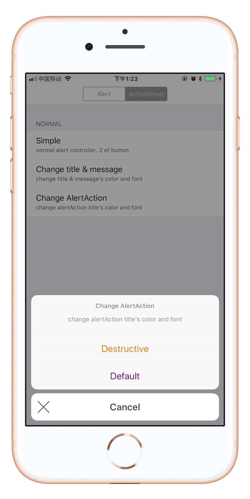

# MultiStyleAlert

[](https://cocoapods.org/pods/MultiStyleAlert)
[](https://cocoapods.org/pods/MultiStyleAlert)
[](https://cocoapods.org/pods/MultiStyleAlert)

## Features
- [x] 改变 UIAlertController title and message 的字体和颜色
- [x] 改变 UIAlertAction title的颜色.
- [x] 简便的弹出。

## Installation

只需将以下行添加到您的**Podfile**

```ruby
pod 'MultiStyleAlert'
```
## ScreenShot
<div align = "center"> 




</div>

## Usage

在使用的文件中导入头文件

```objective-c
#import "MultiStyleAlert.h"

```

```objective-c
UIAlertController *alert = [UIAlertController alertControllerWithTitle:@"Change title & message" message:@"change title & message's color and font " preferredStyle:UIAlertControllerStyleAlert];
[alert addActionWithTitle:@"Cancel" style:UIAlertActionStyleCancel handler:nil];
[alert addActionWithTitle:@"Destructive" style:UIAlertActionStyleDestructive handler:nil];
[alert show];

```

## License

MultiStyleAlert is available under the MIT license. See the LICENSE file for more info.


